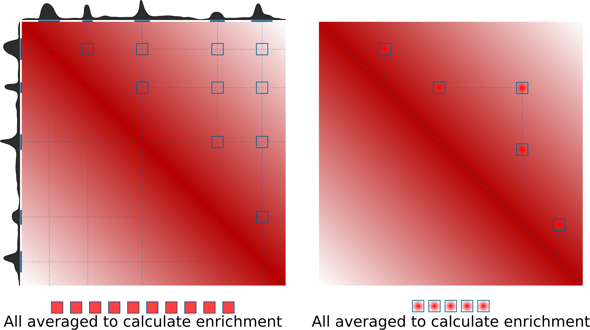

Welcome to coolpup.py's documentation!
======================================

Coolpup.py is a tool to perform pileup analysis of Hi-C data.

Please report any issues or contribute to the developoment at the Github repository: https://github.com/Phlya/coolpuppy

See https://www.biorxiv.org/content/10.1101/586537v4 for details.

.. toctree::
   :maxdepth: 2
   :caption: Contents:

   modules.rst
   coolpup_py_cli_empty.rst

Indices and tables
==================

* :ref:`genindex`
* :ref:`modindex`
* :ref:`search`

