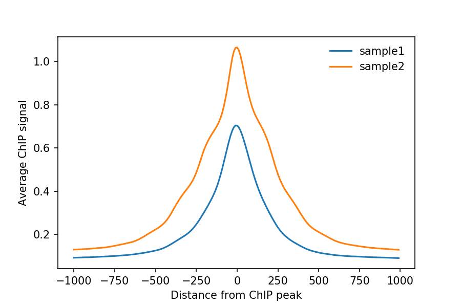
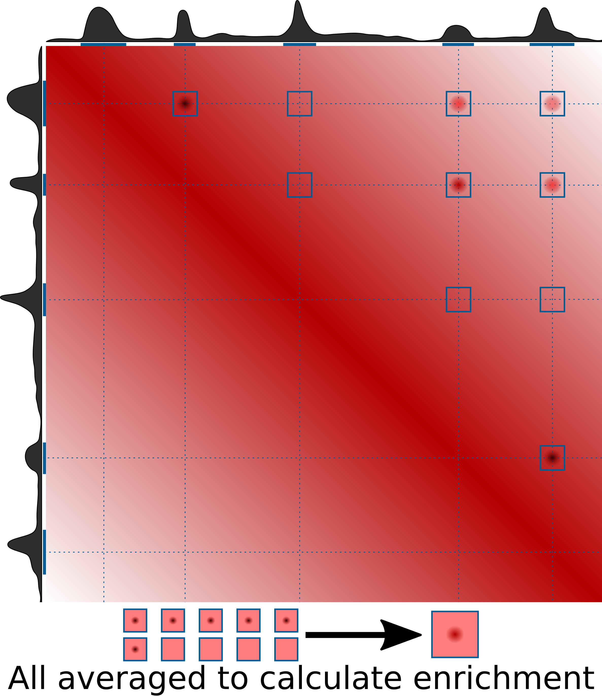
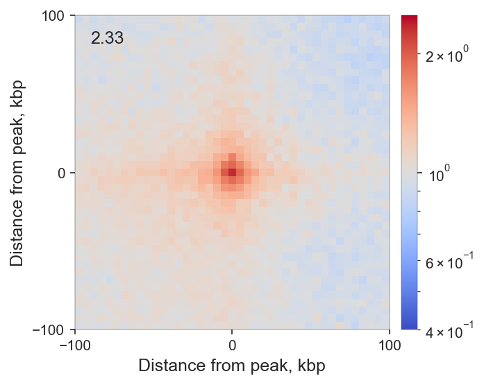
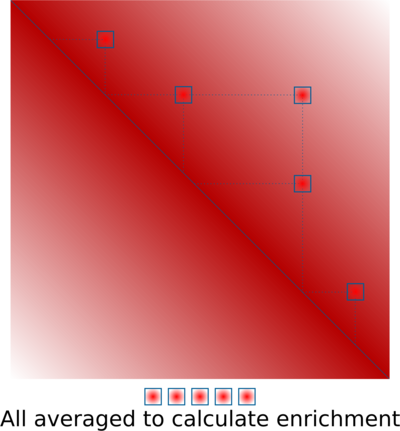
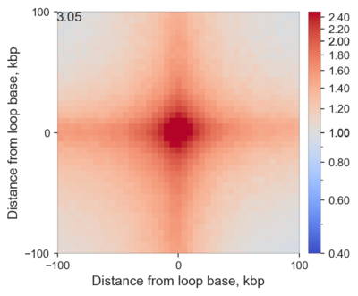
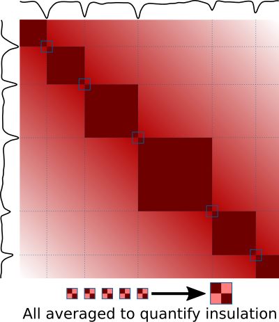
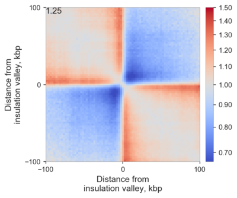
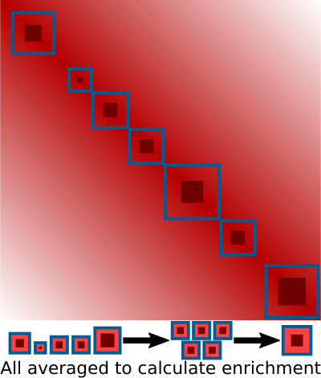
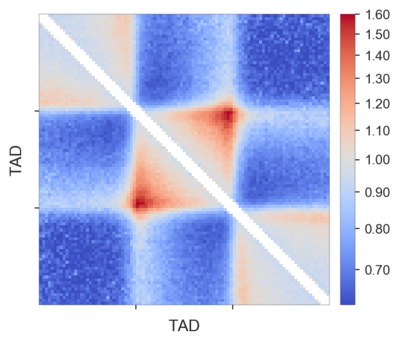

# Guide to pileup analysis

Coolpup.py is a tool for pileup analysis. But what are pile-ups?

If you don't know, you might have seen average ChIP-seq or ATAC-seq profiles which look something like this:

Pile-ups in Hi-C are essentially the same as average profiles, but in 2 dimensions, since
Hi-C data is a a matrix, not a linear track!

Therefore instead of a linear plot, pileups are usually represented as heatmaps - by mapping values of different pixels in the average matrix to specific colours.

## Pile-ups of interactions between a set of regions

For example, we can again start with ChIP-seq peaks, but instead of averaging ChIP-seq data around them, combine them with Hi-C data and check whether these regions are often found in proximity to each other. The algorithm is simple: we find intersections of all peaks in the Hi-C matrix (with some padding around the peak), and average them. If the peaks often interact, we will detect an enrichment in the centre of the average matrix:

Here is a real example:

Here I averaged all (intra-chromosomal) interactions between highly enriched ChIP-seq peaks of RING1B in mouse ES cells. I added 100 kbp padding to each bin containing the peak, and since I used 5 kbp resolution Hi-C data, the total length of each side of this heatmap is 205 kbp. I also normalizes the result by what we would expect to find by chance, and therefore the values indicate observed/expected enrichment. Because of that, the colour is log-scaled, so that the neutral grey colour corresponds to 1 - no enrichment or depletion, while red and blue correspond to value above and below 1, respectively.

What is important, is that in the center we see higher values than on the edges: this means that regions bound by RING1B tend to stick together more, than expected! The actual value in the central pixel is displayed on top left for reference.

This analysis is the default mode when coolpup.py is run with a .bed file, e.g. `coolpup.py my_hic_data.cool my_protein_peaks.bed` (with optional `--expected my_hic_data_expected.tsv` for normalization to the background level of interactions).

## Pile-ups of predefined regions pairs, e.g. loops

A similar approach is based on averaging predefined 2D regions corresponding to interactions of specific pairs of regions. A typical example would be averaging loop annotations. This is very useful to quantify global perturbations of loop strength (e.g. annotate loops in WT, compare their strength in WT vs KO of an architectural protein), or to quantify them in data that are too sparse, such as single-cell Hi-C.
The algorithm is very simple:

And here is a real example of CTCF-associated loops in ES cells:

Comparing with the previous example, you can clearly see that if you average loops that have been previously identified you, of course, get much higher enrichment of interactions, than if you are looking for a tendency of some regions to interact.

This analysis is performed with coolpup.py when instead of a bed file you provide a .bedpe file, so simply `coolpup.py my_hic_data.cool my_loops.bedpe` (with optional `--expected my_hic_data_expected.tsv` for normalization to the background level of interactions). `bedpe` is a simple tab-separated 6-column file with chrom1, start1, end1, chrom2, start2, end2.

## Local pileups

A very similar approach can be used to quantify local properties in Hi-C maps, such as insulation. Valleys of insulation score can be identified (e.g. using `cooltools diamond-insulation`), or another way of identifying potential TAD boundaries can be used. Then regions around their positions can be averaged, and this can be used to visualize and quantify insulation in the same or another sample:

Here is an example of averaged insulation score valleys in mouse ES cells:

One can easily observe that these regions on average indeed have some insulating properties, and moreover the stripes emanating from the boundaries are very clear - they are a combination of real stripes found on edges of TADs in many cases, and loops found at different distances from the boundary in different TADs.

Average insulation can be quantiifed by dividing signal in two red squares (top left and bottom right corners) by the signal in the more blue squares (top right and bottom left corners), and here it is shown in the top left corner.

This analysis is very easily performed using coolpup.py: simply run `coolpup.py my_hic_data.cool my_insulating_regions.bed --local` (with optional `--expected my_hic_data_expected.tsv`  for normalization to the background level of interactions; note that for local analyses in my experience random shift controls work better).

### Rescaled pileups

If instead of boundary regions you have, for example, annotation of long domains, such as TADs, you can also average them to analyse internal interactions within these domains. The problem with simply applying the previous analysis to this case is that these domains can be of different length, and direct averaging will produce nonsensical results. However the submatrices corresponding to interactions within each domain (with some padding around) can all be individually rescaled to the same size, and then averaged. This way boundaries of these domains would be aligned in the final averaged matrices, and the pileups would make sense! here is a visual explanation of this idea:

And here is an example of such local rescaled pileups of TADs annotated using insulation score valleys used above in ES cells:

Each TAD was padded with the flanks of the same length as the TAD, and then they were all rescaled to 99x99 pixels. The pattern of the average TAD is very clear, in particular the corner loop at the top of the domain is highly enriched. Also the stripes, indicative of loop extrusion, both on the TAD borders and outside the TADs, are clearly visible.

You might notice that I removed the few central diagonals of the matrix here. That is because they are often noisy after this rescaling procedure, depending on the data you use. 

To perform this analysis, you simply need to call `coolpup.py my_hic_data.cool my_domains.bed --rescale --local` (with optional `--expected my_hic_data_expected.tsv`  for normalization to the background level of interactions). To specify the side of the final matrix as 99 bins add `--rescale_size 99`. Another useful option here is `--rescale_pad`, which defines the fraction of the original regions to use when padding them; the default value is 1, so each TAD is flanked on each side by a region of the same size.
